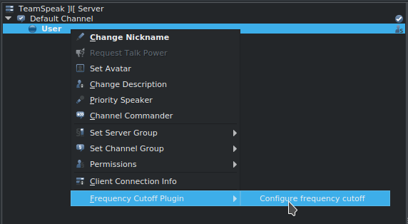
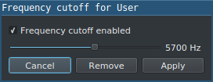

# TeamSpeak3 Frequency Cutoff Plugin

This is a TeamSpeak3 plugin designed to remove audio frequencies above a given level. It can configured on a per-user level. This can be useful if you know people who own devices that emit high pitched noises in the background (e.g. a TV that interacts poorly with their mic).

## Installation

To install the plugin, you should download a compiled version of the plugin for your TeamSpeak version and OS. The plugin needs to be placed in your TeamSpeak plugin folder.

### TeamSpeak version 3.3-? plugin releases (plugin API 23)

Linux (x64): [libfrequency_cutoff_plugin_api23.1.7.0.so](https://github.com/mvilim/ts3-frequency-cutoff-plugin/releases/download/v1.7.0/libfrequency_cutoff_plugin_api23.1.7.0.so)

Windows (x64): [frequency_cutoff_plugin_api23.1.7.0.dll](https://github.com/mvilim/ts3-frequency-cutoff-plugin/releases/download/v1.7.0/frequency_cutoff_plugin_api23.1.7.0.dll)

macOS: not currently released

### TeamSpeak version 3.1.1-3.2.X plugin releases (plugin API 22)

Linux (x64): [libfrequency_cutoff_plugin_api22.1.7.0.so](https://github.com/mvilim/ts3-frequency-cutoff-plugin/releases/download/v1.7.0/libfrequency_cutoff_plugin_api22.1.7.0.so)

Windows (x64): [frequency_cutoff_plugin_api22.1.7.0.dll](https://github.com/mvilim/ts3-frequency-cutoff-plugin/releases/download/v1.7.0/frequency_cutoff_plugin_api22.1.7.0.dll)

macOS: not currently released

### TeamSpeak version 3.1.0.1 plugin releases (plugin API 21)

Linux (x64): [libfrequency_cutoff_plugin_api21.1.7.0.so](https://github.com/mvilim/ts3-frequency-cutoff-plugin/releases/download/v1.7.0/libfrequency_cutoff_plugin_api21.1.7.0.so)

Windows (x64): [frequency_cutoff_plugin_api21.1.7.0.dll](https://github.com/mvilim/ts3-frequency-cutoff-plugin/releases/download/v1.7.0/frequency_cutoff_plugin_api21.1.7.0.dll)

macOS: not currently released

### Plugin folder locations:

Linux/macOS -- ~/.ts3client/plugins/

Windows -- either:

appdata location: %APPDATA%/Roaming/TS3client/plugins

OR

install location (assuming installed in C:\Program Files\): C:\Program Files\TeamSpeak 3 Client\plugins (i.e. inside a folder called plugins immediately inside your TeamSpeak install folder)

## Usage

To use, open the context menu for a client (right click) and select the "Configure frequency cutoff" option.

Drag the slider to the desired frequency, enable the check box, and click apply. Recommended setting is from 4000-6000 Hz.

## Building

[To-do]
